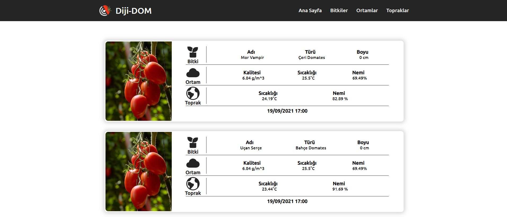

# Diji-DOM Website

This is a website for Diji-DOM. You can follow the greenhouse instantly. You can review the most up-to-date ambient, soil and plant information.



## Getting Started

These instructions will get you a copy of the project up and running on your local machine for development and testing purposes. If you want to make a change, please use the **develop** branch and open a pull request.

### How to use
First you need to download project.
```sh
git clone https://github.com/teknofest-2021/dijidom-database-website
```
And install all dependencies and run.
```sh
npm install
npm start
```

## Built with

* [HTML](https://tr.wikipedia.org/wiki/HTML) - HyperText Markup Language
* [CSS](https://tr.wikipedia.org/wiki/CSS) - Cascading Style Sheets
* [JavaScript](https://www.javascript.com/) - Programming Language
* [React](https://tr.reactjs.org/) - A JavaScript library for building user interfaces


## Authors

* **Ramazan Kaan Yarayan** - [Github](https://github.com/rknyryn)
* **Fehmi Şener** - [Github](https://github.com/fehmiisener)

See also the list of [contributors](https://github.com/teknofest-2021/sanamuze-mobile-app/contributors) who participated in this project.

## Acknowledgments

* Dear Teachers
* Teknofest Executives
* All Team Members
